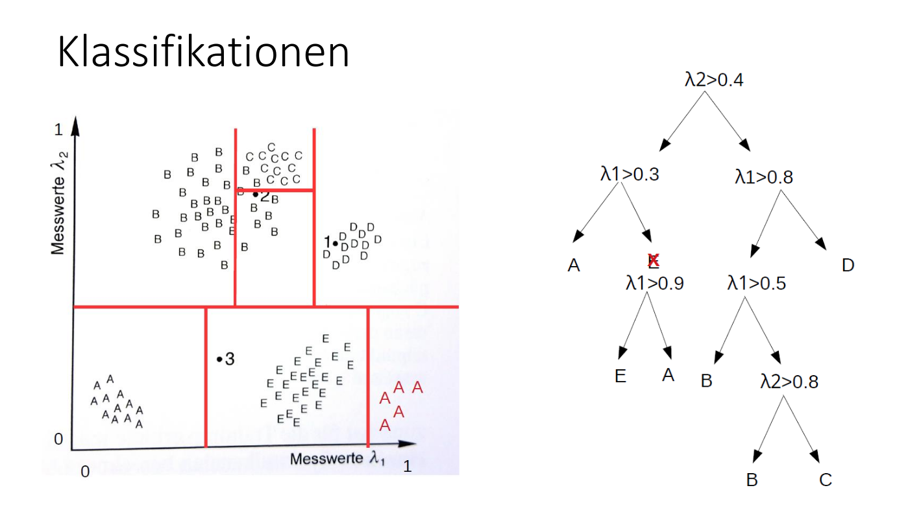
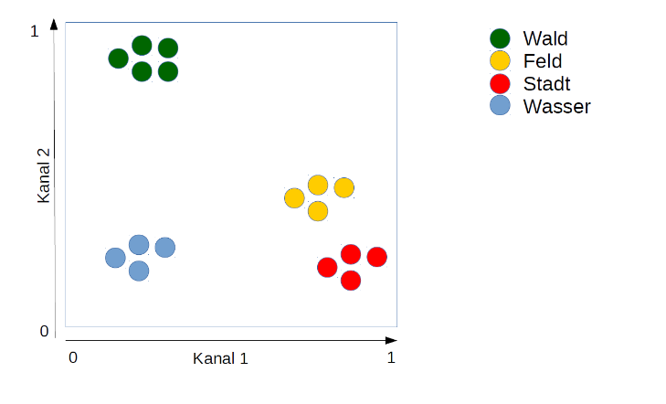
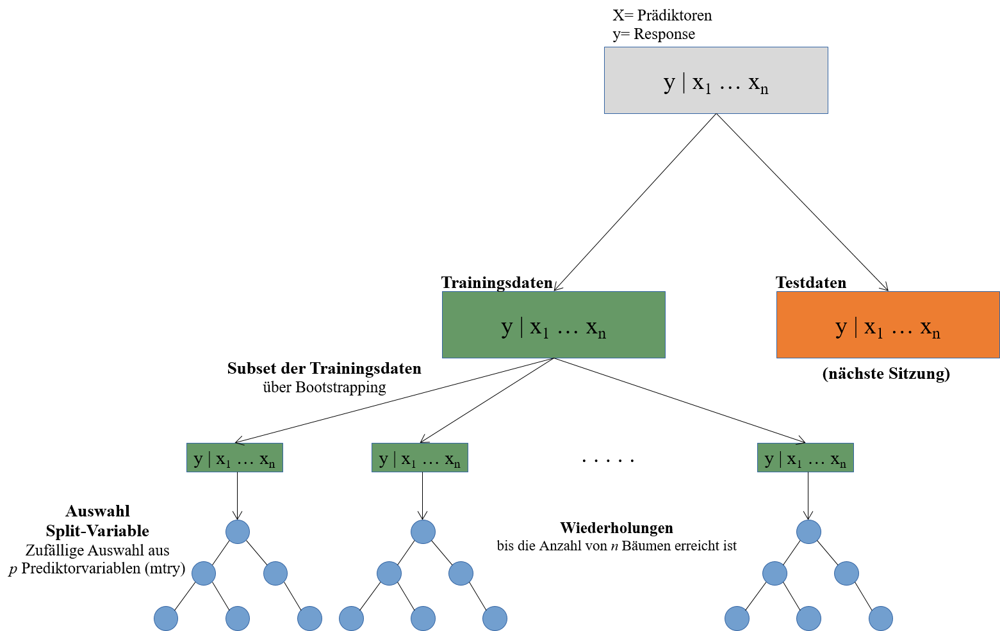
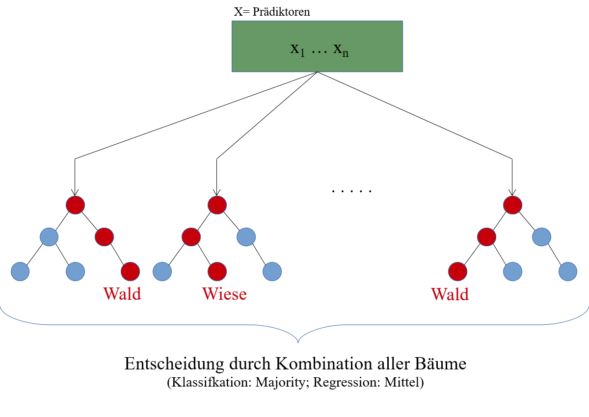

```{r setup, include=FALSE}
knitr::opts_chunk$set(dev = 'pdf')
```

# Wiederholung

## Was machen wir eigentlich?
* Einteilen eines Datensatzes in Gruppen
    * Überwacht
    * Gruppen: Landnutzungsklassen (response)
    * Datensatz: Spektrale Information (predictor)
* Klassifikationsbaum arbeitet mit Grenzen
    * Wie errechnen sich diese Grenzen?

# Wiederholung




# Erstelle einen Klassifikationsbaum



# Beispiel mit dem Iris Datensatz


```{r}
data(iris)
iris <- iris[,c(3:5)]
head(iris)
```

* Predictoren: Petal.Length, Petal.Width
* Response: Species


# Beispiel mit dem Iris Datensatz

```{r}
# install.packages("tree")
library(tree)

kb <- tree(Species ~ .,
           data = iris,
           split = "deviance")
summary(kb)
```


# Beispiel mit dem Iris Datensatz

```{r, echo = FALSE}
plot(kb); text(kb)
```

# Beispiel mit dem Iris Datensatz


```{r, warning=FALSE, message=FALSE, fig.align='center', echo = FALSE}

ggplot2::ggplot(iris, ggplot2::aes(x = Petal.Length, y = Petal.Width, color = Species))+
  ggplot2::geom_point()+
  ggplot2::theme_minimal()

```


# Wie werden die Grenzen berechnet?

* Maschinelles Lernen
    * Lernt "selbstständig" Zusammenhänge in den Daten
    * Benutzt dafür Fehlermaße um optimale Modelle zu finden
    * Dafür wird der Datensatz aufgeteilt um zu testen, wie gut die Einteilung der Gruppen funktioniert
    


# Nochmal mit dem Ganzen Iris Datensatz

```{r}
data(iris)
head(iris)

kb <- tree(Species ~ .,
           data = iris,
           split = "deviance")
```

# Nochmal mit dem ganzen Iris Datensatz

```{r}
plot(kb); text(kb)
```


# Nochmal mit dem ganzen Iris Datensatz

```{r, warning=FALSE, message=FALSE, fig.align='center', echo = FALSE}
caret::featurePlot(x = iris[,1:4], y = iris$Species, plot = "pairs", auto.key = list(columns = 1))
```


# Random Forest

* 2001 von Leo Breiman
* Klassifikationsbaum ist die Grundlage


# Was ist random an Random Forest?

* Bootstrap Sample fuer jeden Baum
    * "Ziehen mit zurücklegen"
    * Für jeden Klassifikationsbaum wird also eine andere Datengrundlage verwendet
* Praediktorenauswahl in jedem Baum
    * Anzahl der betrachteten Praediktoren wird festgelegt (mtry)
    * mtry ist der sogenannte "tuning parameter" für Random Forest
    * Ein Ziel des maschinellen Lernens ist es diesen Parameter optimal zu bestimmen

# Was ist random an Random Forest?



# Was ist random an Random Forest?



# Random Forest in R

* Installieren Sie die Pakete caret und ranger


# Random Forest in R

* Laden Sie die Datentabelle (.RDS Datei) von letzter Woche ein
* Splitten Sie den Datensatz in einen Training- und Testdatensatz
    * Training soll zufällig 70% der Daten beinhalten
    * Test dementsprechend die übrigen 30%
    * ?set.seed()
    * ?createDataPartition()

# Random Forest in R

* Trainieren sie ein Random Forest Model
    * Nutzen Sie dafür den Trainingsdatensatz
    * caret::train()
    * Speichern Sie das Modell als RDS-Datei ab
    
# Random Forest in R

* Wenden Sie das Modell auf das gesamte Untersuchungsgebiet an
    * ?raster::predict()
* Schauen Sie sich das Ergebnis an
    * ?spplot()


# Projektarbeit

## Welche Spezialisierungen wären für einen Artikel denkbar?
* onlinequestions.org
* Event number: 14831


